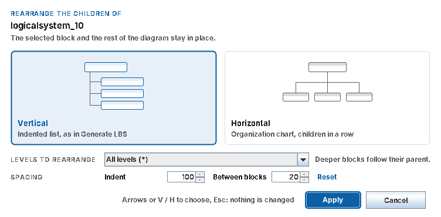
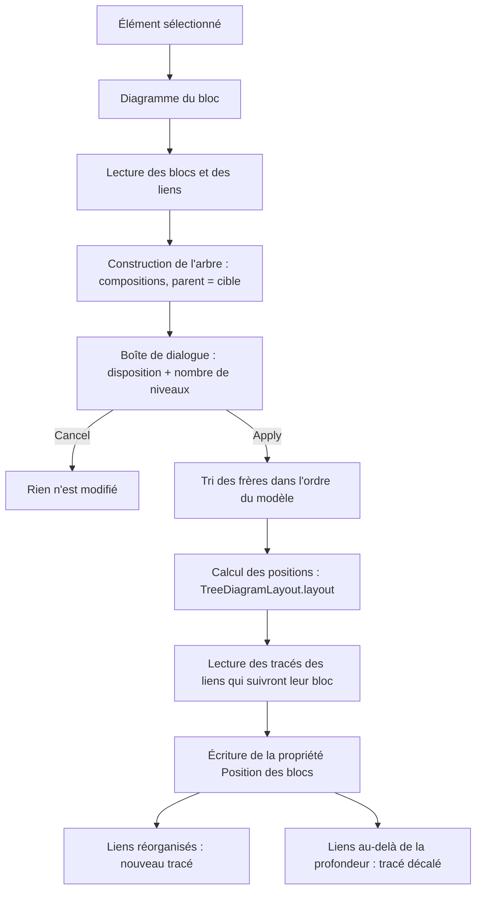

# Rearrange Tree Layout

Commande du plugin Safran (`SafranProfilePlugin`) qui remet en ordre un arbre dans un diagramme Rhapsody (LBS, FBS, TBS...). Les descendants de l'élément sélectionné sont replacés en **liste indentée** (Vertical) ou en **organigramme** (Horizontal), et les liens qui les relient sont redessinés en équerre.

En bref :

- le bloc sélectionné ne bouge pas, ni le reste du diagramme ;
- deux dispositions au choix : Vertical ou Horizontal ;
- le nombre de niveaux réorganisés est choisi par l'utilisateur, comme la profondeur de Generate LBS / FBS / TBS ;
- la taille des blocs est conservée ;
- un seul Ctrl+Z annule toute l'opération.

---

## 1. Où trouver la commande

Deux accès, qui lancent la même commande :

- **Menu contextuel** : clic droit sur un bloc **dans le diagramme**, puis **Safran Toolkit... > Rearrange Tree Layout** ;
- **Barre d'outils Rhapsody** : sélectionner le bloc dans le diagramme, puis cliquer sur le bouton . Le bouton agit sur l'élément sélectionné ; sans sélection valide, la commande affiche un message et ne modifie rien.

Le menu contextuel est proposé sur les éléments suivants (entrée `name45` du fichier `.hep`) :

| Métaclasse |
|---|
| Logical System |
| Logical System With Reference |
| Function |
| Function With Reference |

Si l'élément est sélectionné dans le browser plutôt que dans le diagramme, la commande cherche le diagramme rattaché à l'élément, ou à l'un de ses propriétaires, par une dépendance. C'est le cas des diagrammes créés par Generate LBS / FBS / TBS.

---

## 2. Utilisation pas à pas

1. Ouvrir le diagramme d'arbre et cliquer sur le bloc dont on veut réorganiser les descendants.
2. Lancer **Safran Toolkit... > Rearrange Tree Layout**.
3. Dans la boîte de dialogue :
   - choisir la disposition en cliquant sur une carte (ou avec les flèches gauche / droite, ou les touches **V** / **H**) ;
   - choisir le nombre de niveaux dans **LEVELS TO REARRANGE** ;
   - cliquer sur **Apply** (ou appuyer sur **Entrée**). Un double-clic sur une carte applique directement.
4. Le diagramme est mis à jour immédiatement.

**Cancel** ou **Échap** ferment la boîte sans rien modifier.



La boîte s'ouvre au centre de l'écran où se trouve la souris, c'est-à-dire celui où Rhapsody est utilisé, et reste au premier plan. Les derniers choix (disposition et nombre de niveaux) sont présélectionnés jusqu'à la fermeture de Rhapsody.

---

## 3. Les deux dispositions

### Vertical : liste indentée

Même rendu que les diagrammes produits par Generate LBS.

```
+-------------------+
| logicalsystem_1   |
+---o---------------+
    |     +-------------------+
    +-----| logicalsystem_11  |
    |     +-------------------+
    |     +-------------------+
    +-----| logicalsystem_12  |
    |     +-------------------+
    |     +-------------------+
    +-----| logicalsystem_7   |
          +---o---------------+
              |     +-------------------+
              +-----| logicalsystem_8   |
              |     +-------------------+
              |     +-------------------+
              +-----| logicalsystem_9   |
                    +-------------------+
```

- Chaque enfant est décalé de **100** vers la droite par rapport à son parent.
- Les blocs sont empilés avec **20** d'écart vertical. Un enfant est placé sous le sous-arbre complet de son frère précédent.
- Le lien part du milieu du bord gauche de l'enfant, rejoint une ligne verticale (« épine ») placée à `x + largeur / 8` du parent, puis monte jusqu'au bas du parent. C'est la règle de `utils.D2Rectangle` utilisée par Generate LBS.

### Horizontal : organigramme

```
                  +-------------------+
                  | logicalsystem_1   |
                  +---------+---------+
                            |
        +-------------------+-------------------+
        |                   |                   |
+-------+-------+   +-------+-------+   +-------+-------+
| logicalsys_11 |   | logicalsys_12 |   | logicalsys_7  |
+---------------+   +---------------+   +---------------+
```

- Les enfants sont alignés sur une rangée placée **60** sous le parent et centrée sous lui.
- Deux frères sont séparés de **40**.
- Chaque enfant dispose d'une bande aussi large que son propre sous-arbre, ce qui évite les chevauchements entre cousins.
- Le lien part du milieu du haut de l'enfant, monte jusqu'à une ligne horizontale commune aux frères (le « bus », à mi-distance entre le parent et ses enfants), puis rejoint le milieu du bas du parent.

### Dimensions

Toutes les valeurs sont des constantes de `utils.TreeDiagramLayout` :

| Constante | Valeur | Rôle |
|---|---|---|
| `INDENT` | 100 | décalage d'un niveau (Vertical), identique à Generate LBS |
| `V_GAP` | 20 | écart entre deux blocs empilés (Vertical), identique à Generate LBS |
| `H_GAP` | 40 | écart entre deux frères (Horizontal) |
| `LEVEL_GAP` | 60 | écart entre un parent et la rangée de ses enfants (Horizontal) |

---

## 4. Nombre de niveaux à réorganiser

La liste **LEVELS TO REARRANGE** propose :

- **All levels (\*)** : tout le sous-arbre est réorganisé ;
- **1 level (children only)** : seuls les enfants directs ;
- **2 levels**, **3 levels**... jusqu'à la profondeur réelle de l'arbre sous le bloc sélectionné.

Avec N niveaux :

- les niveaux 1 à N sont replacés dans la disposition choisie, et leurs liens sont redessinés ;
- au-delà, chaque sous-arbre **garde exactement sa disposition** et se déplace d'un seul bloc avec son ancêtre de niveau N. Ses liens sont décalés du même déplacement, sans changer de forme ;
- ces blocs sont placés selon leur encombrement total, pour ne chevaucher ni leurs voisins ni l'épine du parent.

**Exemple : combiner les deux dispositions**

1. Sélectionner `logicalsystem_7`, puis choisir **Vertical** et **All levels** : ses descendants forment une liste indentée.
2. Sélectionner `logicalsystem_1`, puis choisir **Horizontal** et **1 level** : ses enfants passent en rangée, et `logicalsystem_7` emmène sa liste indentée avec lui, intacte.

---

## 5. Ce qui est modifié, ce qui ne l'est pas

| Modifié | Inchangé |
|---|---|
| Position des descendants du bloc sélectionné | Le bloc sélectionné |
| Tracé des liens entre ces descendants et leur parent | Le lien entre le bloc sélectionné et son propre parent |
| | Les frères, le parent et les autres arbres du diagramme |
| | La taille des blocs |
| | Les liens qui ne sont pas des compositions (associations, dépendances...) |
| | La position des libellés des liens |
| | Le modèle : aucun élément n'est créé, supprimé ou renommé |

Seul l'aspect graphique du diagramme change.

---

## 6. Comment l'arbre est reconnu

1. **Blocs** : chaque élément graphique qui représente un élément de modèle. Le cadre du diagramme est ignoré.
2. **Liens** :
   - si le diagramme contient des liens de composition (propriété graphique `Type = ContainArrow`), **seuls ces liens forment l'arbre**. Les autres liens sont ignorés et laissés tels quels ;
   - pour une composition, la **source est l'enfant** et la **cible est le parent** ;
   - sans composition dans le diagramme, tous les liens sont utilisés, et le parent est déterminé par l'appartenance dans le modèle (`getOwner`), puis, à défaut, par la position (le parent est le bloc le plus haut).
3. **Ordre des frères** : celui du modèle (`getNestedElementsByMetaClass("Class", 0)`), comme dans Generate LBS. Un enfant absent de cette liste est placé à la fin, dans son ordre vertical actuel.
4. **Garde-fous** :
   - un bloc n'a qu'un seul parent, et un second lien vers un autre parent est ignoré ;
   - un lien qui fermerait une boucle est ignoré ;
   - si un élément est dessiné deux fois, seul le premier bloc est pris en compte.

Chaque garde-fou déclenché écrit un avertissement (`WARN`) dans le journal.

---

## 7. Annuler

Le plugin exécute la commande dans une transaction d'annulation. **Un seul Ctrl+Z** dans Rhapsody annule tous les déplacements de blocs et tous les tracés de liens de l'opération.

---

## 8. Messages affichés

| Message (toast) | Signification |
|---|---|
| `Select an element in the breakdown diagram.` | Aucun élément sélectionné. |
| `No diagram found. Open the breakdown diagram and select the element in it.` | Aucun diagramme trouvé pour l'élément sélectionné. |
| `The selected element is not drawn in diagram ...` | L'élément sélectionné n'est pas représenté dans ce diagramme. |
| `... has no child in this diagram.` | Aucun enfant de l'élément n'est dessiné et relié dans ce diagramme. |

---

## 9. Journal (log)

Le plugin écrit dans la fenêtre **Output** de Rhapsody, onglet **Log**. Une exécution produit :

```
[ INFO] ... - Start - Safran Toolkit...\Rearrange Tree Layout
[ INFO] ... - Selected: logicalsystem_1 | diagram: logicalbreakdownstructure_14
[ INFO] ... - End - Safran Toolkit...\Rearrange Tree Layout (VERTICAL, depth *): 6 block(s) moved, 6 link(s) redrawn, 0 link(s) shifted.
```

- `block(s) moved` : nombre de blocs déplacés.
- `link(s) redrawn` : nombre de liens redessinés dans la nouvelle disposition.
- `link(s) shifted` : nombre de liens au-delà de la profondeur choisie, décalés sans changer de forme.

Pour obtenir le détail lien par lien (tracé calculé, liens ignorés), mettre la propriété de projet `General.Model.ThresholdLevel` à `DEBUG`.

---

## 10. Limites connues

- **Seuls les blocs présents dans le diagramme sont réorganisés.** Un élément du modèle qui n'est pas dessiné n'est pas ajouté : pour reconstruire le diagramme à partir du modèle, utiliser Generate LBS / FBS / TBS.
- **Les blocs hors du sous-arbre ne sont jamais déplacés.** Si le sous-arbre réorganisé les recouvre, un avertissement `Rearranged block overlaps a block outside the subtree` est écrit dans le journal, et il faut les déplacer à la main.
- **La taille des blocs n'est pas uniformisée.** Les blocs gardent leur largeur et leur hauteur actuelles.
- **Les libellés des liens ne sont pas repositionnés.**

---

## 11. Installation et mise à jour

1. Copier les fichiers listés au chapitre 12 dans le projet Eclipse `SafranProfilePlugin`, ou faire un `git pull`.
2. Vérifier que l'onglet **Erreurs** d'Eclipse est vide.
3. Clic droit sur `build_safran_app.jardesc`, puis **Create JAR**, pour produire `safran_app.jar`.
4. Copier `safran_app.jar` dans `SafranArchitectureProfile/SafranArchitectureProfile_EXE/`.
5. Vérifier l'entrée de menu dans `SafranArchitectureProfile/SafranArchitectureProfile_rpy/SafranArchitectureProfile.hep` :

   ```
   name45=Safran Toolkit...\Rearrange Tree Layout
   isPlugInCommand45=1
   command45=SafranPlugin
   applicableTo45=Logical System, Logical System With Reference, Function, Function With Reference
   isVisible45=1
   ```

   Le texte après `name45=` doit être identique à la constante `RearrangeTreeLayout.COMMAND`, sinon le menu affiche « No existing tool for ».

   Et l'entrée du bouton de la barre d'outils :

   ```
   name54=Rearrange Tree Layout
   isPlugInCommand54=1
   command54=SafranPlugin
   isToolbarButton54=1
   pluginIcon54=..\Icons\RearrangeTree16.png
   isVisible54=1
   ```

   Le texte après `name54=` doit être identique à la constante `RearrangeTreeLayout.TOOLBAR_COMMAND`, et l'icône `RearrangeTree16.png` (PNG 16 x 16) doit être présente dans `SafranArchitectureProfile/Icons/`.

6. Fermer complètement Rhapsody et le relancer : le jar et le `.hep` ne sont relus qu'au chargement du profil.
7. Contrôler dans le journal la ligne `Build version used: 20261008_15-20`, qui confirme que le nouveau jar est chargé.

---

## 12. Architecture du code

| Fichier | Rôle |
|---|---|
| `src/main/java/tools/RearrangeTreeLayout.java` | La commande : lit le diagramme, construit l'arbre, demande les choix, applique la géométrie et écrit le résultat dans Rhapsody. |
| `src/main/java/utils/TreeDiagramLayout.java` | La géométrie pure : positions des blocs et tracés des liens. N'utilise pas l'API Rhapsody, donc testable sans Rhapsody. |
| `src/main/java/main/gui/tools/TreeLayoutOrientationDialog.java` | La boîte de dialogue (style `UiKit`, placement `utils.DialogPlacement`). |
| `src/main/java/main/SafranProfilePlugin.java` | Enregistrement de la commande dans `RhpPluginInit`, sous ses deux noms (`COMMAND` pour le menu, `TOOLBAR_COMMAND` pour le bouton). |
| `SafranArchitectureProfile/Icons/RearrangeTree16.png` | Icône du bouton de la barre d'outils (16 x 16). |
| `src/test/java/test/unittest/TreeDiagramLayoutTest.java` | 12 tests JUnit 5 de la géométrie. |
| `src/test/java/test/manual/DumpDiagramGraphicalProperties.java` | Programme de diagnostic (`main`) : affiche les propriétés graphiques des blocs et des liens du diagramme ouvert. |
| `src/test/java/test/manual/RepositionTreeLinks.java` | Programme de test (`main`) ayant servi à valider l'écriture des tracés de liens. |

Déroulement de la commande :



### Propriétés graphiques utilisées

| Élément | Propriété | Format | Usage |
|---|---|---|---|
| Bloc | `Position` | `x,y` (coin haut gauche) | lue et écrite |
| Bloc | `Width`, `Height` | entier | lues seulement |
| Lien | `Type` | `ContainArrow` pour une composition | lue |
| Lien | `SourcePosition`, `TargetPosition` | `x,y` | écrites |
| Lien | `Polygon` | `n,x1,y1,x2,y2,...,xn,yn` | lue (liens décalés) et écrite |

Dans `Polygon`, le premier point est l'extrémité côté source et le dernier l'extrémité côté cible. Rhapsody peut ajuster une extrémité de 1 pixel pour la coller exactement sur la bordure du bloc.

Les propriétés `Polygon` et `Type` ne sont pas documentées dans la Javadoc. Elles ont été relevées avec `getAllGraphicalProperties()`, comme le recommande la Javadoc de `setGraphicalProperty`, à l'aide de `DumpDiagramGraphicalProperties`.

### Compatibilité

Toutes les méthodes de l'API utilisées existent dans Rhapsody 10.0.2 et 10.0.3 (vérification faite sur la Javadoc des deux versions). Code Java 17, fichiers sources en ASCII, compatibles avec l'encodage Cp1252 du projet.

---

## 13. Tests

`TreeDiagramLayoutTest` se lance sans Rhapsody : clic droit, puis **Run As > JUnit Test**. Les tests couvrent :

- la reproduction exacte de la disposition de Generate LBS (coordonnées attendues bloc par bloc) ;
- l'immobilité du bloc sélectionné et la conservation de la taille des blocs ;
- le tracé des liens en Vertical (épine) et en Horizontal (bus) ;
- le centrage de la rangée et la largeur des bandes en Horizontal ;
- la profondeur limitée dans les deux dispositions (sous-arbres déplacés d'un bloc) ;
- la lecture, l'écriture et le décalage des valeurs `Polygon`.

---

## 14. Dépannage

| Symptôme | Cause probable | Solution |
|---|---|---|
| Le menu affiche « No existing tool for » | Le nom dans le `.hep` ne correspond pas à la commande | Corriger `name45` (chapitre 11, étape 5). |
| Le bouton affiche « No existing tool for: Rearrange Tree Layout » | Ancien `safran_app.jar`, sans l'alias `TOOLBAR_COMMAND` | Régénérer et recopier le jar (chapitre 11). |
| Le bouton n'apparaît pas dans la barre d'outils | Entrée `name54` absente du `.hep` chargé, ou Rhapsody non redémarré | Vérifier le `.hep` (chapitre 11, étape 5), puis relancer Rhapsody. |
| Le bouton apparaît sans image | `RearrangeTree16.png` absente de `SafranArchitectureProfile/Icons/` | Copier l'icône. |
| Le journal affiche `Start - RearrangeTreeLayout (partial layout)` | L'ancien `safran_app.jar` est encore chargé | Régénérer le jar, le copier, relancer Rhapsody (chapitre 11). |
| `End - ... 0 block(s) moved` | Diagramme déjà rangé, ou enfants non reliés par des compositions | Vérifier les liens. Passer le journal en `DEBUG` pour voir les liens ignorés. |
| `endUndoTransaction failed: ... Transaction was not created` | Aucune modification effective : tout était déjà en place | Sans conséquence. |
| Des blocs se chevauchent après l'opération | Un bloc hors du sous-arbre se trouve dans la zone réorganisée | Voir l'avertissement `overlaps` du journal et déplacer le bloc concerné. |
